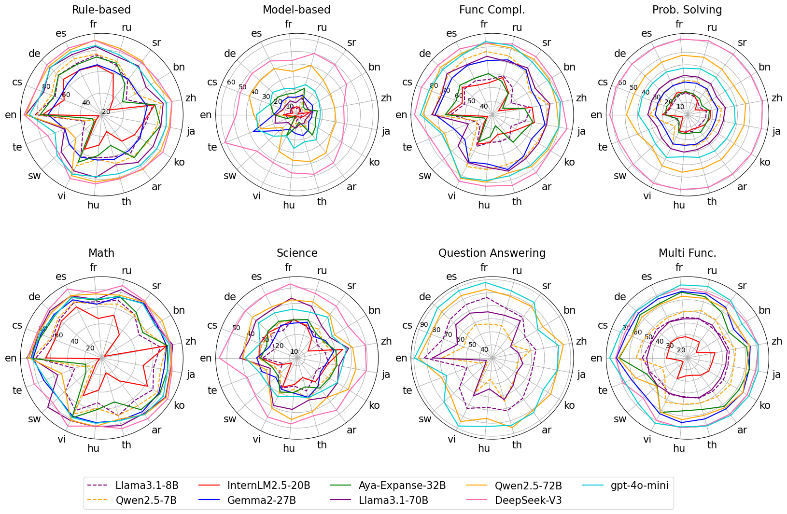

# BenchMAX: A Comprehensive Multilingual Evaluation Suite for Large Language Models

[**HuggingFace**](https://huggingface.co/collections/LLaMAX/benchmax-674d7a815a57baf97b5539f4) | [**Arxiv**](https://arxiv.org/pdf/2502.07346) | [**Citation**](#citation)

BenchMAX is a comprehensive, high-quality, and multiway parallel multilingual benchmark
comprising 10 tasks designed to assess crucial capabilities across 17 diverse language.

## News

**🔥[Feb 12, 2025] Released the multilingual benchmark**

## Dataset Download
We evaluate multiple crucial capabilities of large language models(LLMs) in multilingual scenarios. The dataset links are as follows:

| Dataset                      | Evaluated Capability   | HuggingFace Dataset Path                                                                            |
|------------------------------|------------------------|-----------------------------------------------------------------------------------------------------|
| BenchMAX_Rule-based          | Instruction following  | [🤗 BenchMAX_Rule-based](https://huggingface.co/datasets/LLaMAX/BenchMAX_Rule-based)                   |
| BenchMAX_Model-based         | Instruction following  | [🤗 BenchMAX_Model-based](https://huggingface.co/datasets/LLaMAX/BenchMAX_Model-based)                 |
| BenchMAX_Function_Completion | Code generation        | [🤗 BenchMAX_Function_Completion](https://huggingface.co/datasets/LLaMAX/BenchMAX_Function_Completion) |
| BenchMAX_Problem_Solving     | Code generation        | [🤗 BenchMAX_Problem_Solving](https://huggingface.co/datasets/LLaMAX/BenchMAX_Problem_Solving)         |
| BenchMAX_Math                | Reasoning              | [🤗 BenchMAX_Math](https://huggingface.co/datasets/LLaMAX/BenchMAX_Math)                               |
| BenchMAX_Science             | Reasoning              | [🤗 BenchMAX_Science](https://huggingface.co/datasets/LLaMAX/BenchMAX_Science)                         |
| BenchMAX_Question_Answering  | Long context modelling | [🤗 BenchMAX_Question_Answering](https://huggingface.co/datasets/LLaMAX/BenchMAX_Question_Answering)   |
| BenchMAX_Multiple_Functions  | Tool use               | [🤗 BenchMAX_Multiple_Functions](https://huggingface.co/datasets/LLaMAX/BenchMAX_Multiple_Functions)   |
| BenchMAX_General_Translation | Translation            | [🤗 BenchMAX_General_Translation](https://huggingface.co/datasets/LLaMAX/BenchMAX_General_Translation) |
| BenchMAX_Domain_Translation  | Translation            | [🤗 BenchMAX_Domain_Translation](https://huggingface.co/datasets/LLaMAX/BenchMAX_Domain_Translation)   |

## Results
We evaluate common multilingual large language models as shown in the following table.
The results are averaged across 17 languages.


The detailed results for each language are illustrated in the figure below.



## Supported Languages
Arabic, Bengali, Chinese, Czech, English, French, German, Hungarian, Japanese, Korean, Serbian, Spanish, Swahili, Telugu, Thai, Russian, Vietnamese

<a name="citation"></a>
## Citation
If our dataset helps your work, please cite this paper:
```
@article{huang2025benchmax,
  title={BenchMAX: A Comprehensive Multilingual Evaluation Suite for Large Language Models},
  author={Huang, Xu and Zhu, Wenhao and Hu, Hanxu and He, Conghui and Li, Lei and Huang, Shujian and Yuan, Fei},
  journal={arXiv preprint arXiv:2502.07346},
  year={2025}
}
```
